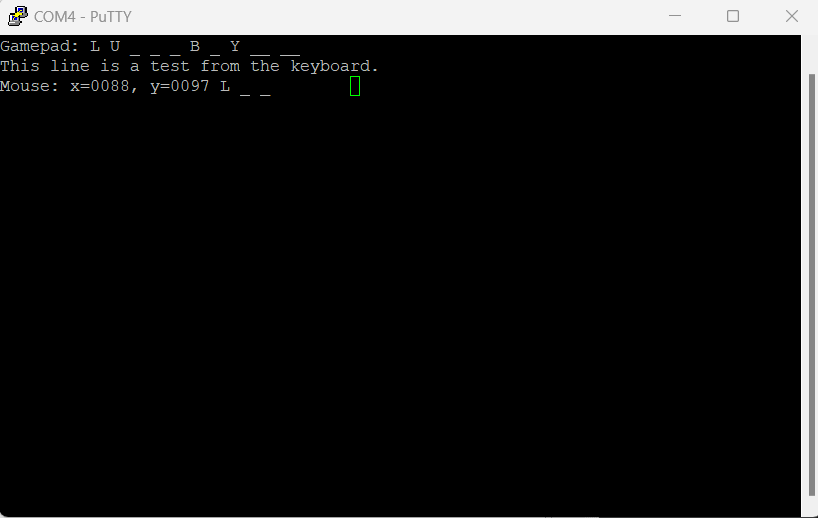
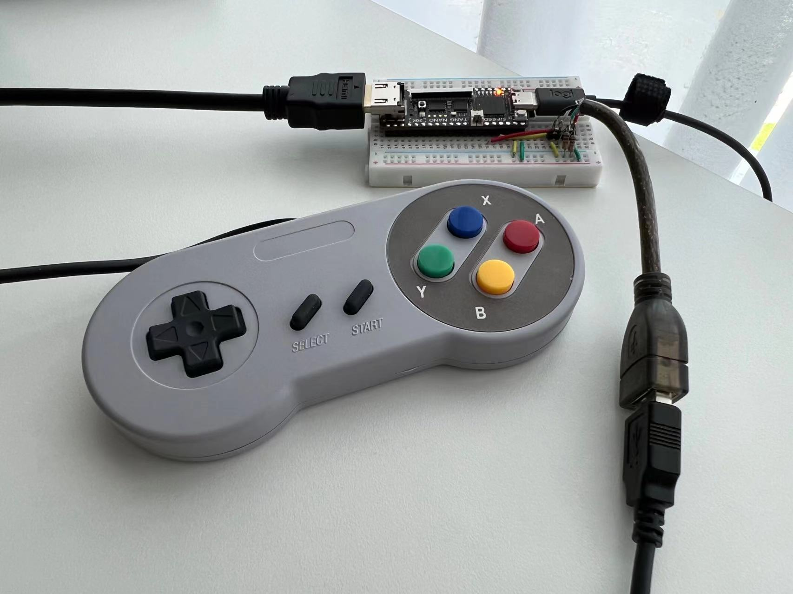

# Compact USB HID host FPGA core

nand2mario, 8/2023

Usb_hid_host is a compact FPGA core designed to support USB keyboards, mice and gamepads. It is designed mainly for FPGA retro gaming and computing projects. The most significant advantage is its all-in-one design. It does not require a CPU to work. And it is quite small (<300 LUTs, <250 registers and 1 BRAM block).

To use usb_hid_host, simply add `usb_hid_host.v`, `usb_hid_host_rom.v` and `usb_hid_host_rom.hex` to your project. The module interface in `usb_hid_host.v` should be sufficiently documented to get you started.

Please refer to [usb_hid_host.md](doc/usb_hid_host.md) for a more comprehensive introduction to the design of the core.

## Sample projects

Sample projects are available for the following boards to demonstrate the usage of usb_hid_host.

* [Tang Nano 20K](boards/tang-nano-20k/) (Gowin GW2A FPGA). Gowin IDE project file `usb_hid_proj.gprj` is provided. Simply open it in Gowin IDE and build the project. 
* [IceSugar-Pro](boards/icesugar-pro/) and [Machdyne Schoko](boards/schoko/) (Lattice ECP5). These come with Makefiles for the open source Yosys/nextpnr toolchain. 
* [iCEBreaker](boards/icebreaker) and [Machdyne Riegel](boards/riegel/) (Lattice iCE40), also building with Yosys/nextpnr.

Connect your USB devices and expect results similar to the following.

 

Usb_hid_host does not rely on vendor-specific primitives, making it compatible with most FPGAs and boards. If you encounter any problems, please submit an issue.

## Future Improvements

* Handling multiple devices on a single port (USB hubs).
* Support for full-speed devices.
* Testing compatibility with more devices.

## Credit

* Based on [hi631's project](https://github.com/hi631/tang-nano-9K/tree/master/NES) supporting USB gamepad on Tang Nano 9K.
